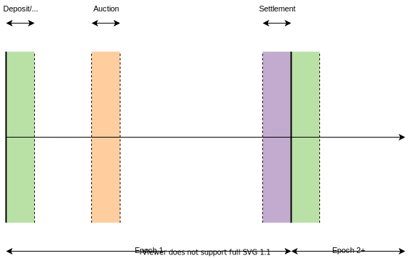

# Zeta DEX Put Selling Vault

This is a reference implementation for a put selling vault that leverages the Zeta derivatives DEX under the hood. In short, this vault periodically sells put options in return for attractive premiums.

In order to run the testing script, we need to replace the vault PID with your own. We can do this by simply running scripts/replace-pid.sh.

```sh
./scripts/replace-pid.sh
```

**Disclaimer: This code is currently unaudited, use at your own risk.**

## Tokenized Ownership

We introduce a simple tokenized ownership mechanism, whereby users who ape into the pool are given "redeemable" zTokens, representing the fraction of USDC they contributed to the vault.

The more the vault earns in USDC terms, the higher the exchange rate goes - meaning for a profitable vault 1 zToken will be redeemable for >1 USDC.

### Exchange Rates

Deposit: $1\ zToken = 1\ usdc$

Withdraw: $1\ zToken = \frac{usdc_{total}}{zToken_{total}}\ usdc$

## Epoch Schedule



## Phases

### 1. Deposit/Withdraw

_Friday 10-11am UTC_

Unrestricted deposits and withdraws of USDC into the platform by means of swapping in and out of zTokens. Users can either realise PnL or leave their funds in the vault, causing them to be automatically rolled into the following epoch.

### 2. Auction

_Anytime Friday 11am - Friday (t+1) 8am UTC_

1. Instrument selection: vault admin selects 5-delta strike put option and 7 days till expiry (DTE) option (off-chain for now).
2. Auction: vault sells _n_ put options on the Zeta DEX where $n = \frac{usdc_{total}}{K}$ i.e. the max number of options such that if all were to be exercised the vault would be able to fully collateralise them.

In future we can come up with more sophisticated auction mechanisms, but for now we use the simplest method of making MMs commit to taking down the full size of the vault.

### 3. Settlement

_Friday (t+1) 8-10am UTC_

All positions taken on by the vault during the week (via the auction) are settled on the underlying Zeta DEX at expiry. There are two primary outcomes:

1. OTM: puts finish OTM and vault gets to keep the premiums (~95% chance)
2. ITM: puts finish ITM causing a loss for the vault (~5% chance)

### 4. Rollover

_Friday (t+1) 10am UTC_

Vault admin calls the `rollover_vault` instruction to update the vault epoch schedule to the following week. Rinse and repeat.
